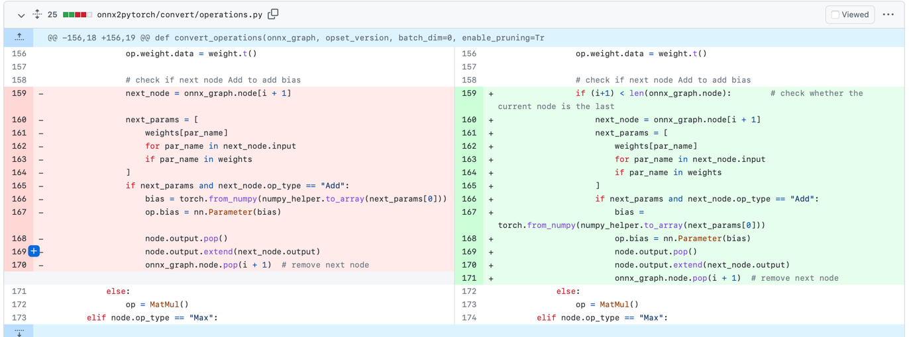
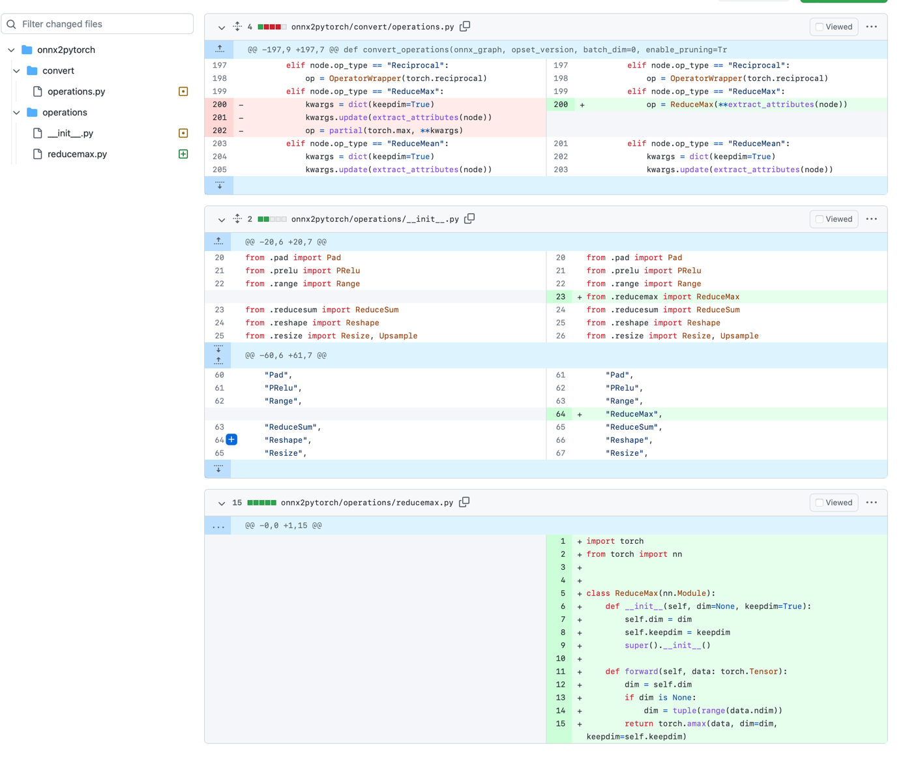

## Patch 1 (add a preprocess_pads function):

see pr: https://github.com/Talmaj/onnx2pytorch/pull/41 for details.

Add below function to the `onnx2pytorch/operation/pad.py` file in onnx2pytorch:

```
def preprocess_pads(in_activations):
    """
    If pads is 8-d array for 4d input or pads is 6-d array for 3d input.
    Convert pads from [b1,b2,...,e1,e2,...] to [b1,e1,b2,e2,...]
    """
    input = in_activations[0]
    pads = list(in_activations[1])
    if len(pads)//2 == len(input.size()):
        import torch
        new_pads = []
        mid_idx = len(pads)//2
        pads.reverse()
        for i in range(mid_idx, len(pads)):
            new_pads.append(pads[i])
            new_pads.append(pads[i-mid_idx])
        in_activations[1] = torch.tensor(new_pads)
    return in_activations
```

Add the following new branch at line 205 in the `onnx2pytorch/convert/model.py` file:

```
if node.op_type == "Pad":
     # preprocess pad in case it is 8-d array or 6-d array
     from onnx2pytorch.operations.pad import preprocess_pads
     in_activations = preprocess_pads(in_activations)
```

## Patch 2 (add a new branch for LSTM's activation function conversion)

Add the following two lines to line 46 in file `onnx2pytorch/convert/attribute.py`.

```
elif attr.type == AttributeTypes["STRINGS"]:
    value = tuple(attr.strings)[-1].decode()
```
This patch is to deal with the `NotImplementedError: Extraction of attribute type 8 not implemented.` when converting LSTM layer.

## Patch 3 (special case when MatMul node is the last one)

see pr: https://github.com/Talmaj/onnx2pytorch/pull/28/files


## Patch 4 (Add ReduceMax operator)
see pr: https://github.com/Talmaj/onnx2pytorch/pull/37/files


